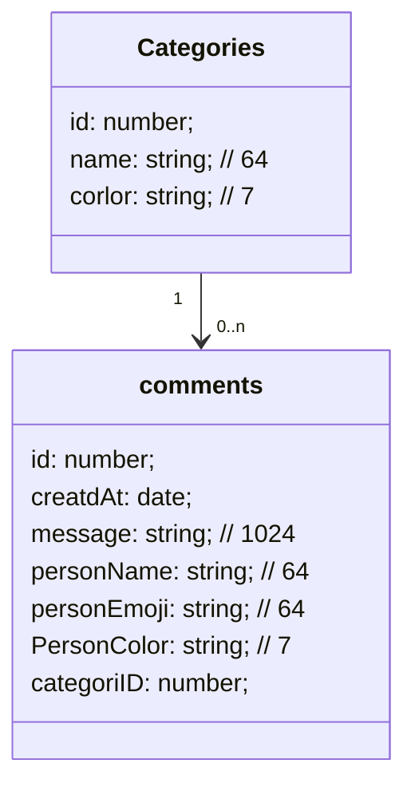

```mermaid
classDiagram

class Categories {
    id: number;
    name: string; // 64
    corlor: string; // 7

}

Categories "1" --> "0..n" comments

class comments {

    id: number;
    creatdAt: date;
    message: string; // 1024
    personName: string; // 64
    personEmoji: string; // 64
    PersonColor: string; // 7
categoriID: number;
}

```